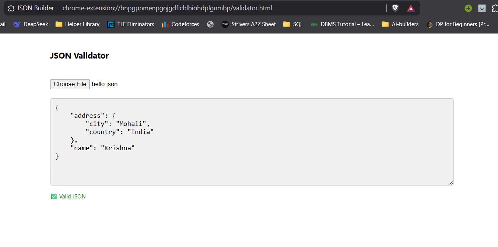

# 🧰 JSON Builder & Validator Chrome Extension

A handy **Extension** for developers that allows you to easily create, edit, import, export, and validate JSON data in a user-friendly and interactive way.

---

## 🚀 Features

- 🔧 **Dynamic JSON Input Builder**  
  Add and manage multiple key-value pairs using input fields — not raw JSON editing.

- 🧩 **Nested Objects Support**  
  Easily input nested objects using the format:  
  `city=Muzaffarnagar, country=India`

- 🧾 **Array Support**  
  Add arrays using simple format:  
  `[item1, item2, item3]`

- 📁 **Import JSON File**  
  Upload an existing `.json` file to auto-populate the form fields.

- 📤 **Download & Copy JSON**  
  One-click download or clipboard copy of your structured JSON.

- 🔍 **JSON Validator Tool**  
  A separate validator page where you can paste or upload JSON and instantly check validity.

- 📂 **Collapsible Viewer**  
  Interactive UI to expand/collapse nested keys and arrays visually.

- 🌙 **Dark Mode Toggle**  
  Clean and responsive UI with light/dark theme switch.

---

### 📸 Screenshots

#### 🧰 JSON Builder Page

A clean UI for dynamically adding and managing key-value pairs, including support for:

- Nested objects using `key=key1=value1, key2=value2`
- Arrays using `[item1, item2, item3]`
- File upload to auto-generate JSON
- One-click copy and download


---

#### ✅ JSON Validator Page

Paste raw JSON or upload a `.json` file to validate structure and formatting. Helpful for quickly testing responses or API mocks.



---

## 🛠️ How It Works

- Use the input fields to define your JSON keys and values.
- Values can be:
  - Strings, numbers
  - Arrays: `[a, b, c]`
  - Nested objects: `city=Delhi, country=India`
- Built JSON is shown live.
- Copy or Download JSON anytime.
- Use the **Validator Page** to test JSON validity or upload a file for quick checking.

---

## 📦 Installation (Local Dev)

```bash
git clone https://github.com/krishnas005/Json-Builder-And-Validator.git
cd Json-Builder-And-Validator
npm install
npm run build
```
This will create a dist/ folder for your Chrome extension.

### Load the Extension in Chrome

1. Open ``chrome://extensions/``
2. Enable Developer Mode
3. Click "Load unpacked"
4. Select the  ``dist/`` folder

## 👨‍💻 Built With

1. React
2. Vite
3. CSS